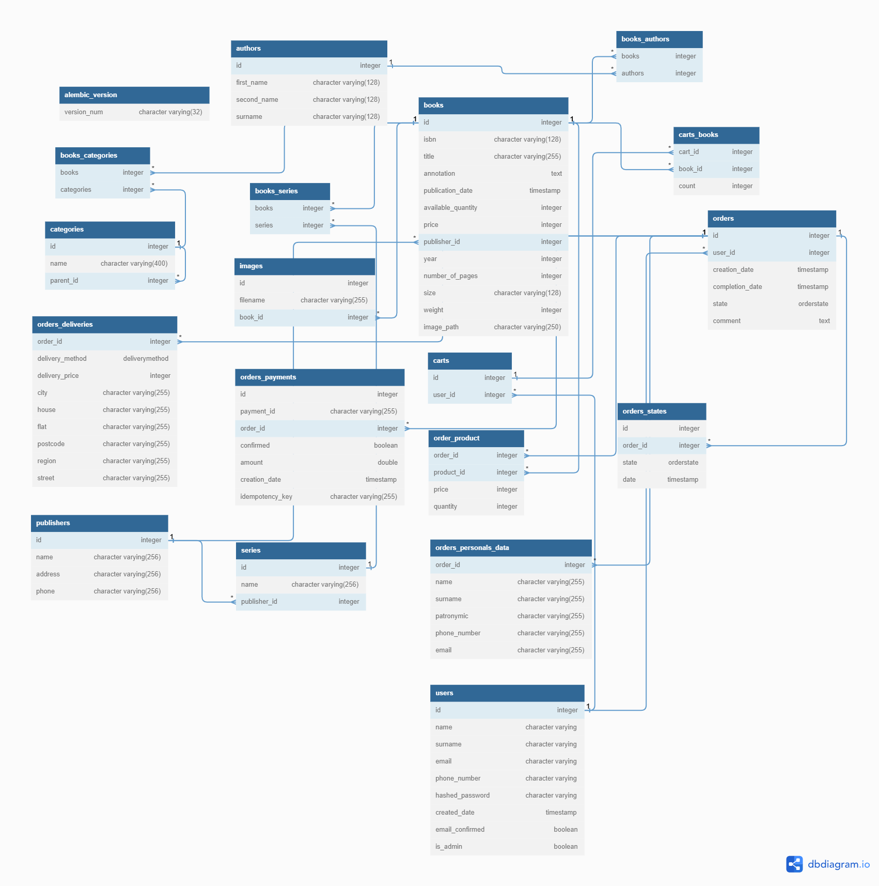
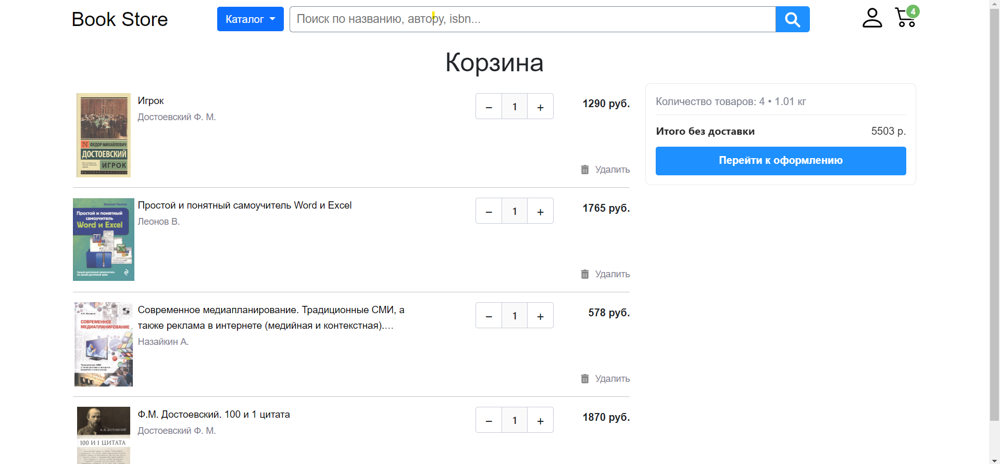

# Bookstore - http://vingp-timur-ts-bookstore.ru

Bookstore - простой книжный интернет-магазин написанный на python с использованием
flask. Целью данного проекта было изучить веб-фреймворк flask и его расширения,
разобраться с работой веб сайтов, а также изучить следующие технологии:

- Docker и Docker compose
- Git
- PostgreSQL
- Elasticsearch
- Nginx
- Grafana
- Prometheus
- Loki
- API ЮKassа
- API Dadata
- Bootstrap5
- Jquery
- Ajax
- Pre-commit
- SSL (Let's Encrypt и Certbot)
- Gunicorn
- Mailcow
- Развёртывание проекта на сервер

## Запуск проекта

___

### Запуск проекта локально:

#### 1) Клонируем репозиторий

```shell
git clone https://github.com/VinGP/bookstore.git
```

#### 2)Заходим в директорию репозитория

```shell
cd bookstore
```

#### 3) Редактируем файлы

1. переименовываем файл *.env.dev.example* -> *.env*
2. Редактируем переменные в файле *.env* (по желанию)
    - Вместо MailHog вы можете подключить свою электронную почту, например Gmail:
        - MAIL_SERVER = smtp.gmail.com
        - MAIL_PORT = 587
        - MAIL_USE_TLS = true
        - MAIL_USERNAME = адрес (example@gmail.com)
        - MAIL_PASSWORD = пароль
    - Добавьте `YOOKASSA_ACCOUNT_ID` и `YOOKASSA_SECRET_KEY`, чтобы работала оплата
      ЮKassа:
        - YOOKASSA_ACCOUNT_ID=<Идентификатор магазина>
        - YOOKASSA_SECRET_KEY=<Секретный ключ>\
          Чтобы оплата работала необходимо использовать
          ngrok. [Документация ЮKassа](https://yookassa.ru/developers/using-api/interaction-format)
          Если ключи не добавлена оформление заказа будет работать без оплаты.
    - Для работы подсказок при вводе адреса необходимо добавить ключи Dadata:
        - DADATA_SECRET_KEY=<API-ключ>
        - DADATA_API_KEY=<Секретный ключ>

#### 4) Поднимаем контейнер

```shell
docker compose up --build -d
```

или с помощью make

```shell
make dev
```

#### 5) Создаём и применяем миграции

```shell
docker compose exec web python -m alembic revision --autogenerate
docker compose exec web python -m alembic upgrade head
```

#### 6) Добавляем администратора

```shell
docker compose exec web python manage.py add_admin admin admin admin@admin admin
```

#### 7) Добавление данных в базу

По желанию вы можете сразу заполнить базу данных. Файл books.json должен находиться
рядом
с файлом bookstore/manage.py, картинки необходимо поместить в папку
bookstore/app/static/image/book/ \
[Ссылка](https://disk.yandex.ru/d/vCj5ceJBRDFDBg) на `books.json` и папку `book` с
фотографиями книг. На данный момент там находится 7500 книг.

```shell
docker compose exec web python manage.py insert_db_data
```

#### Для разработки:

После выполнения пунктов для локального запуска, надо выполнить следующие команды:

```shell
python -m venv venv
.\venv\Scripts\activate    
pip install -r bookstore/requirements-dev.txt
pre-commit install 
```

По итогу у вас должны заработать следующие сервисы:

- Bookstore
    - http://localhost:5000 - Основное приложение
    - http://localhost:5000/admin - Панель администрации
- MailHog (Для тестирования отправки почты)
    - http://localhost:8025/ - веб интерфейс
    - http://localhost:1025/ - SMTP сервер
- Postgresql
    - http://localhost:54320/ - База данных приложения (54320 - для локального
      подключения; 5432 - внутри контейнеров)
    - http://localhost:5050/ - pgAdmin для администрирования базы данных (email:
      admin@admin.com; пароль: root)
- pgAdmin:
    - http://localhost:5050
    - Чтобы подключиться к базе приложение необходио указывает хост и порт внутри
      контейнеров, т.e host - db и port - 5432
- Kibana:
    - http://localhost:5601

### Запуск проекта на сервере:

___

Все те же шаги, что и при запуске проекта локально, кроме третьего пункта:

#### 3) Редактируем файлы

1. переименовываем файл *.env.prod.example* -> *.env*
2. удаляем файл *docker compose.yml*
3. переименовываем файл *docker compose.prod.yml* -> *docker compose.yml*
4. Редактируем переменные в файле *.env*

### Запуск проекта на сервере c SSL сертификатом и мониторингом:

В проекте использовался бесплатный сертификат от Let’s Encrypt. Для этого вам надо
приобрести доменное имя, делать DNS-записи типа A со значениями:

- @ - your_ip
- www - your_ip

#### 1) Клонируем репозиторий

```shell
git clone https://github.com/VinGP/bookstore.git
```

#### 2)Заходим в директорию репозитория

```shell
cd bookstore
```

#### 3) Редактируем файлы

1. переименовываем файл *.env.prod.ssl.example* -> *.env*
2. удаляем файл *docker compose.yml*
3. переименовываем файл *docker compose.prod.ssl.yml* -> *docker compose.yml*
4. Редактируем переменные в файле *.env*
    - DOMAIN - ваш домен (example.org)
    - DOMAIN_WWW - домен третьего уровня (www.example.org)
    - EMAIL - адрес электронной почты для сертификата

    - Добавьте `YOOKASSA_ACCOUNT_ID` и `YOOKASSA_SECRET_KEY`, чтобы работала оплата
      ЮKassа:
        - YOOKASSA_ACCOUNT_ID=<Идентификатор магазина>
        - YOOKASSA_SECRET_KEY=<Секретный ключ> \
          Чтобы оплата работала необходимо использовать
          ngrok. [Документация ЮKassа](https://yookassa.ru/developers/using-api/interaction-format)
          Если ключи не добавлена оформление заказа будет работать без оплаты.

    - Для работы подсказок при вводе адреса необходимо добавить ключи Dadata:
        - DADATA_SECRET_KEY=<API-ключ>
        - DADATA_API_KEY=<Секретный ключ> \
          Также необходимо переименовать `nginx_ssl.example` -> `nginx_ssl`. Далее
          замените все `<your_ip>` на ip адрес вашего сервера, а все `<your_domain>` на
          ваш домен.
          Также в этом файле добавлена конфигурация mailcow, если он находится на одном
          сервере с
          приложением. [Установка mailcow](https://docs.mailcow.email/i_u_m/i_u_m_install/#installation-via-paketmanager-plugin)
          , [nginx proxy](https://docs.mailcow.email/post_installation/firststeps-rp/)
          чтобы не было конфликта 80-x портов у mailcow-nginx и nginx приложения.
          (Если вы не захотите использовать mailcow в качестве вашего почтового сервера,
          просто удалите все после комментария `# mailcow config`)

#### 4) Получаем сертификаты:

```shell
bash init-letsencrypt.sh
```

#### 5) Поднимаем контейнер

```shell
docker compose up --build -d
```

#### 6) Создаём и применяем миграции

```shell
docker compose exec web python -m alembic revision --autogenerate
docker compose exec web python -m alembic upgrade head
```

#### 7) Добавляем администратора

```shell
docker compose exec web python manage.py add_admin admin admin admin@admin admin
```

#### 8) Добавление данных в базу

По желанию вы можете сразу заполнить базу данных. Файл `books.json` должен находиться
рядом
с файлом bookstore/manage.py, картинки необходимо поместить в папку
bookstore/app/static/image/book/ \
[Ссылка](https://disk.yandex.ru/d/vCj5ceJBRDFDBg) на `books.json` и папку `book` с
фотографиями книг. На данный момент там находится 7500 книг.

```shell
docker compose exec web python manage.py insert_db_data
```

По итогу у вас должны заработать следующие сервисы:

- Bookstore
    - https://<your_domain> - Основное приложение
    - https://<your_domain>/admin - Панель администрации
- Grafana:
    - http://<your_domain>:3000
- Prometheus:
    - http://<your_domain>:9090
- pgAdmin:
    - http://<your_domain>:5050
    - Чтобы подключиться к базе приложение необходио указывает хост и порт внутри
      контейнеров, т.e host - db и port - 5432
- Kibana:
    - http://<your_domain>:5601

## Схема проекта

<p align='center'>
	
</p>

## Схема проекта с мониторингом

<p align='center'>
	
</p>

## Схема базы данных

<p align='center'>
	
</p>

В директории `README` есть .pdf файл схемы базы данных в лучшем качестве

## Скриншоты

Скриншоты находятся в директории <a href='README/screenshots'>
README/screenshots</a>

Главная страница:

<p align='center'>
	
</p>

Корзина:

<p align='center'>
	
</p>

## Полезные ссылки:

- [Документация ЮKassа](https://yookassa.ru/developers/using-api/interaction-format)
- [API Dadata](https://dadata.ru/api/)
- [Статья про мониторинг](https://habr.com/ru/companies/macloud/articles/556518/)
- [Докеризация Flask приложения](https://testdriven.io/blog/dockerizing-flask-with-postgres-gunicorn-and-nginx/)
- [Установка Docker linux](https://www.digitalocean.com/community/tutorials/how-to-install-and-use-docker-on-ubuntu-20-04-ru)
- [swap](https://www.digitalocean.com/community/tutorials/how-to-add-swap-space-on-debian-11)
  для более стабильной работы elasticsearch на сервере с малым количеством RAM

## TODO

- Celery для организации рассылки писем
- Redis для кеширования
- ML для рекомендательной системы
- Google Analytics / Яндекс.Метрика
- Добавить объектное хранилище (MinIO) или S3 для фотографий и медиафайлов
- Kubernetes
- Vue.js для frontend
- CI/CD
- FastAPI